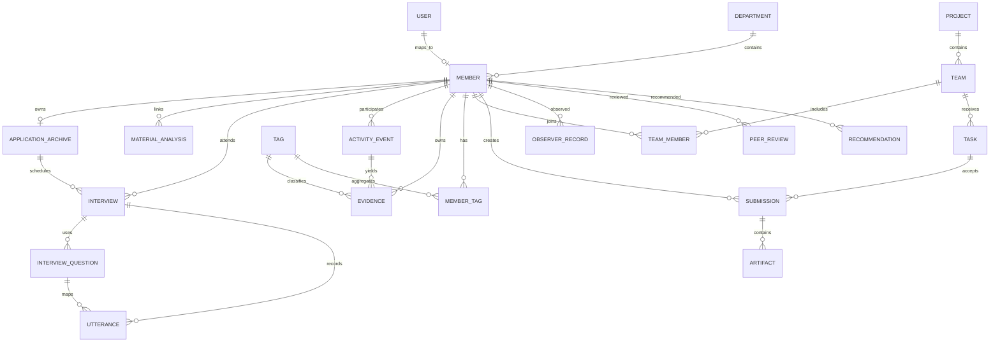

# 核心数据库 ER 设计

Phase 1 已落地 `members`、`application_archives`、`material_analyses`、`interviews`、`interview_questions`、`utterances`、`activity_events`、`evidence`、`tags`、`member_tags` 与 `audit_logs`。

`members.lifecycle_stage` 区分纳新候选人与正式社团成员。`application_archives` 保存每位报名者的一人一档视图，`raw_answers.submissions` 保留一个或多个原始提交，实现聚合但不丢数据。`material_analyses` 保存上传文件清单、AI 摘要、事实、疑点与建议面试问题，并可关联到具体报名者。

`members.personality_profile` 保存版本化人格信号：框架、状态、标签、强度、置信度、证据数量和原文依据。技术兴趣继续保存在 `members.interests`，不与人格推断混用。

## Evidence 不变量

- `source_type + source_id` 必须可定位原始来源。
- `raw_payload` 保存 Provider 结构化输出，人工修改另存为 `review_note` 与审核字段。
- `status` 只允许 `pending / accepted / rejected / modified`。
- `strength` 与 `confidence` 范围为 0 到 1。
- MemberTag 保存聚合结果与证据数量，不覆盖历史 Evidence。
